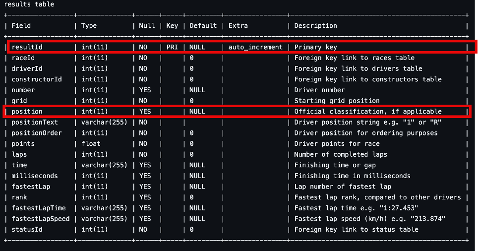

We have observed the following on the competition data:

Instead of the predicted finishing position, what is actually contained
in the data

## Our Observation:

**Different positions for the same race**

How can this be? The dataset is a join over multiple tables from the
ergast dataset. Specifically, the result table and

at least the driver standings table

How do we know this?

The dataset providers, had to manually compose a unique id because of
exactly the above-described problem. The RESULT DRIVER STANDING id. They state it on their [kaggle webpage](https://www.kaggle.com/c/f1nalyze-datathon-ieeecsmuj/data).

### The BIG problem

They don’t use the correct target variable for prediction. It’s the driver standing position and not the race result position. But it is terribly difficult to unclutter the dataset.
